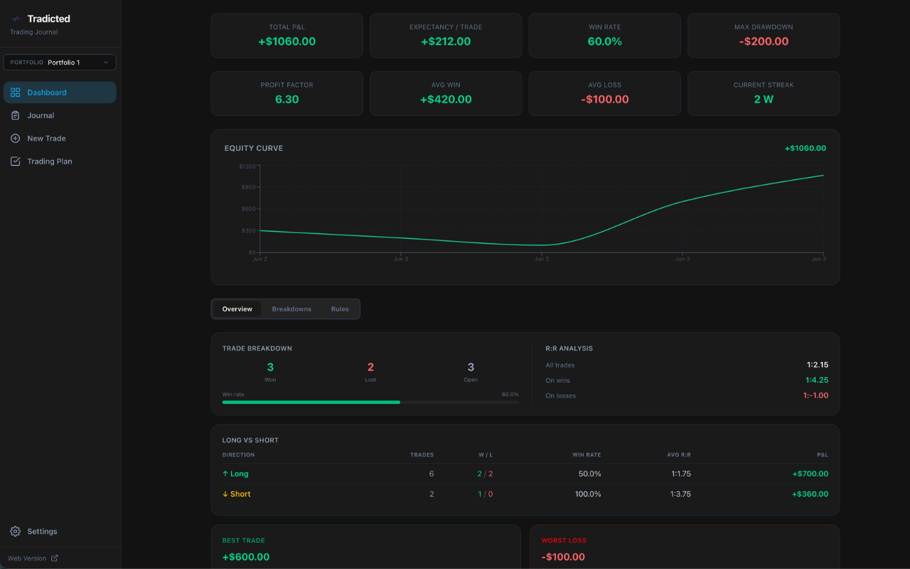
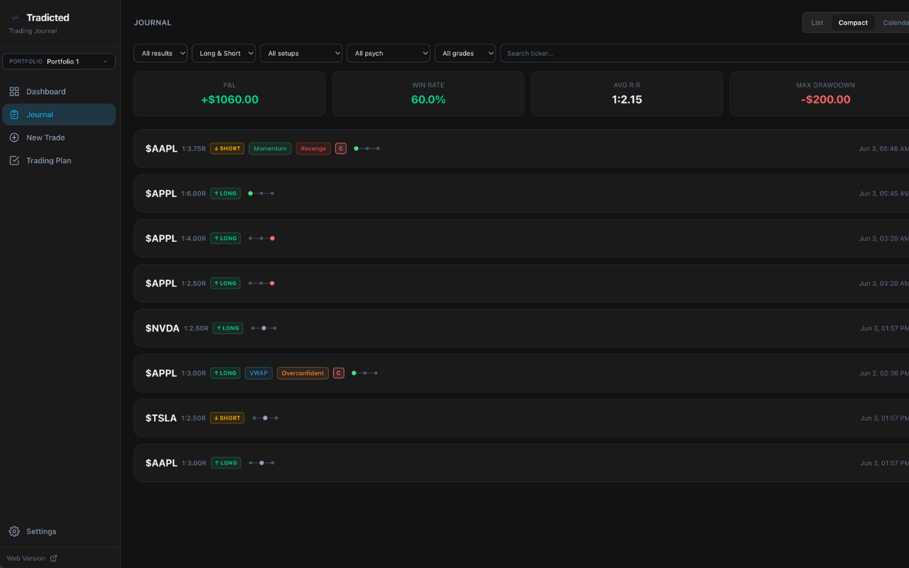

# Tradicted Journal — Free Open-Source Desktop Trading Journal

A free, offline-first desktop trading journal for Windows, macOS, and Linux. Built by the team behind [Tradicted](https://tradicted.com/) — the stock market trading simulator.

> Try the web version: **https://tradicted.com/trading-journal/**

[](LICENSE)
[]()
[](https://www.electronjs.org/)

---

## Features

- **Risk-Reward Calculator** — position sizing, R:R ratio, breakeven win rate, dollar risk/reward
- **Multiple Portfolios** — separate accounts, strategies, or asset classes; each with its own trades and settings
- **Trade Log** — filterable cards with inline editing; bulk status updates
- **Trading Plan** — rule-based checklist referenced before each trade entry
- **Analytics Dashboard** — equity curve, monthly P&L, win rate, profit factor, expectancy, max drawdown, streak tracking, rule adherence analytics
- **Journal** — calendar view with daily P&L, setup tags, psychology tags, trade grades, and notes
- **New Trade Form** — full trade entry with auto-calculated R:R, dollar risk/reward, and position size
- **Export / Import** — CSV export and import of all trade data
- **Offline-first** — all data stored locally in SQLite; no account required

---

## Screenshots




---

## Download

Pre-built installers are available on the [GitHub Releases](https://github.com/tradicted/tradicted-journal/releases) page.

| Platform | Format |
|---|---|
| Windows | NSIS installer `.exe`, portable `.exe` |
| macOS | `.dmg`, `.zip` |
| Linux | `.AppImage`, `.deb`, Snap |

---

## Try the Web Version

The web-based trading journal is available for free at:

**https://tradicted.com/trading-journal/**

The desktop app is a standalone offline companion — no account needed, all data stays on your machine.

---

## Built With

| Technology | Purpose |
|---|---|
| [Electron](https://www.electronjs.org/) | Desktop runtime |
| [React 19](https://react.dev/) | UI framework |
| [TypeScript](https://www.typescriptlang.org/) | Type safety |
| [Tailwind CSS v4](https://tailwindcss.com/) | Styling |
| [SQLite (better-sqlite3)](https://github.com/WiseLibs/better-sqlite3) | Local database |
| [Recharts](https://recharts.org/) | Charts |
| [React Router v7](https://reactrouter.com/) | Navigation |
| [electron-vite](https://electron-vite.org/) | Build tooling |

---

## Development

### Prerequisites

- Node.js 20 LTS (managed via fnm)
- npm

### Install

```bash
npm install
```

### Development

```bash
npm run dev
```

### Build

```bash
# For Windows
npm run build:win

# For macOS
npm run build:mac

# For Linux
npm run build:linux
```

Output: `dist-electron-build/` (JS bundle compiled to `out/` first)

---

## Contributing

See [CONTRIBUTING.md](CONTRIBUTING.md).

---

## License

MIT © [Tradicted](https://tradicted.com) — See [LICENSE](LICENSE).
